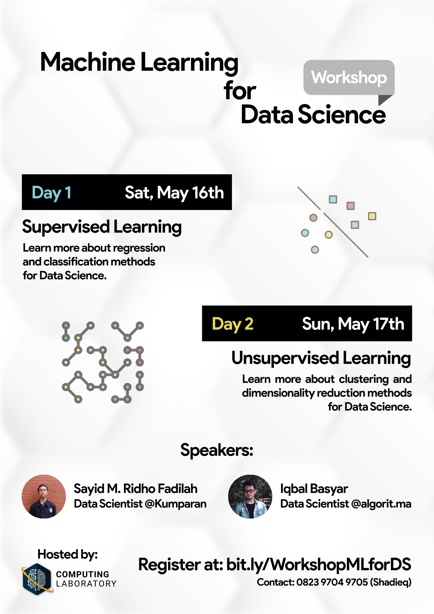

# [Machine Learning for Data Science Online Workshop]

Have you ever learned how Machine Learning method is used in Data Science?
Now, you can learn it in Machine Learning for Data Science Workshop by Computing Laboratory right from our awesome speakers!

This event will be held on May, 16th - 17th 2020 (13.00-16.00 WIB). Things you are going to learn:

1. Implementing Supervised Learning with Scikit-learn
    - Classification with SVM
    - Regression with Decision Tree and Random Forest
2. Implementing Unupervised Learning with Scikit-learn
    - Dimensionality with PCA
    - Clustering with KMeans

How to register?

1. Fill the form at bit.ly/WorkshopMLforDS (The workshop is already over, by the way. This repository is just an archive),
2. We will send you the meeting link,
3. and you're good to go!

You will get Certificate and Soft Module about Machine Learning for Data Science!

Don't worry, it's free and open for all Telkom University students!

What are you waiting for? Register now!

For more infomation, you can contact:  
💬: Shadieq  
📱: 082397049705 (Whatsapp/Line)

💬: Rizki  
📱: 08972183875 (Whatsapp/Line)

